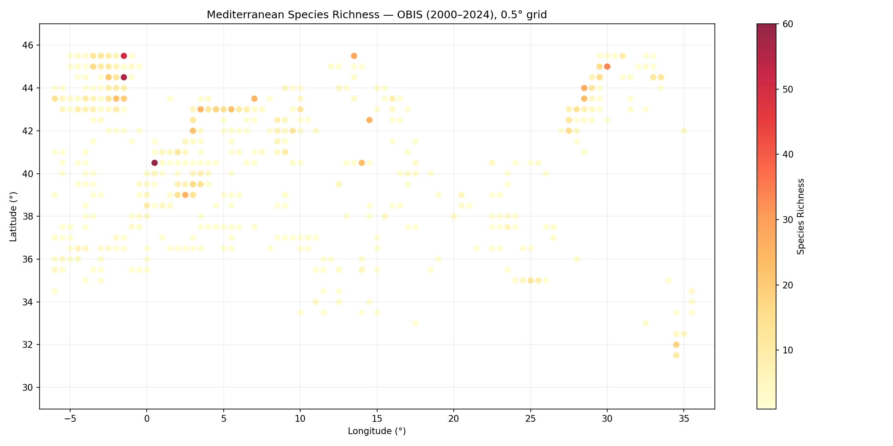
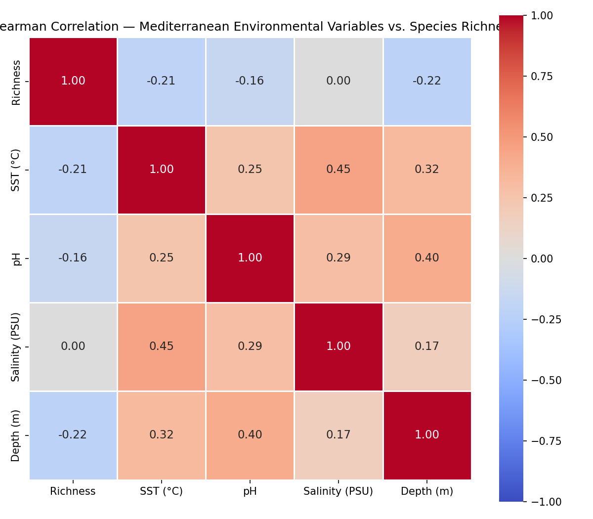
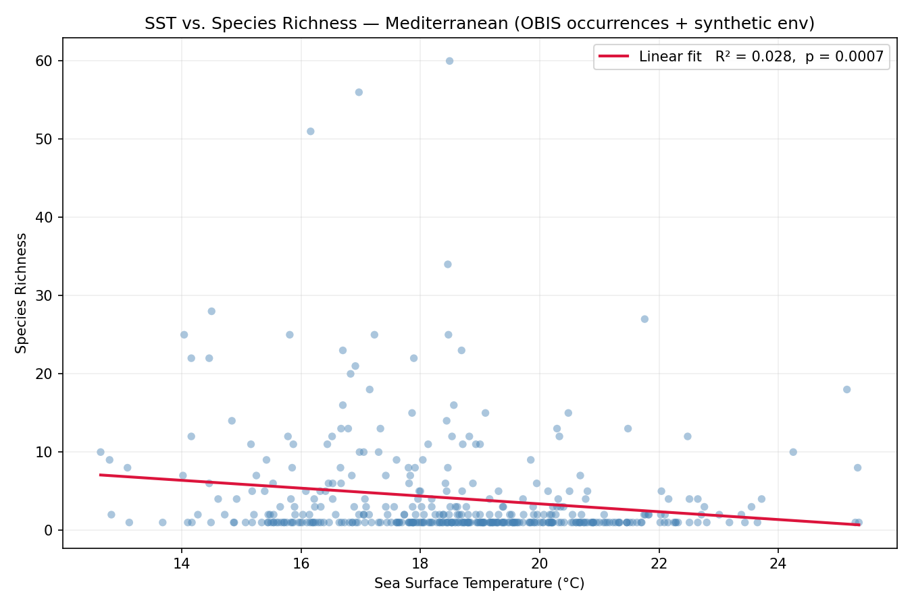
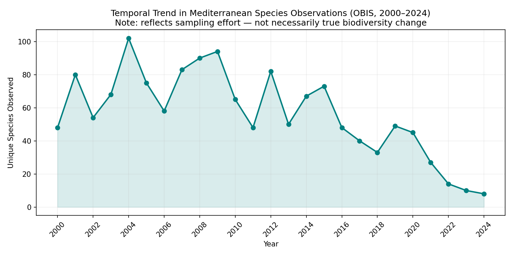

# Mediterranean Marine Biodiversity Analysis

Exploratory Data Analysis (EDA) of species richness and oceanographic variables across
the Mediterranean Sea, combining real species occurrence data from
[OBIS](https://obis.org) with synthetic environmental variables calibrated on
CMEMS Mediterranean climatology ranges.

## Research Questions

- How does Sea Surface Temperature (SST) correlate with species richness across the Mediterranean?
- What spatial patterns emerge in biodiversity distribution at 0.5° resolution?
- Is there a detectable temporal trend in species observations (2000–2024)?

## Data Sources

| Source | Type | Notes |
|--------|------|-------|
| [OBIS API v3](https://api.obis.org) | Species occurrences | Real data, >2,000 records, 2000–2024 |
| `src/env_generator.py` | SST, pH, salinity, depth | Synthetic with ranges from CMEMS Med climatology |

## Project Structure

```
marine_data_analysis_project/
├── src/
│   ├── obis_loader.py      # Fetch species occurrences from OBIS API
│   ├── env_generator.py    # Generate synthetic environmental grid (0.5° cells)
│   └── analysis.py         # Merge + 4 EDA plot functions
├── tests/                  # pytest unit + integration tests (14 tests)
├── data/
│   ├── raw/                # Downloaded and generated CSVs (gitignored)
│   └── processed/          # Merged analytical dataset (gitignored)
├── figures/                # Output figures (included in repo)
├── outputs/figures/        # Local pipeline output (gitignored)
├── main.py                 # Run full pipeline end-to-end
└── requirements.txt
```

## Setup

```bash
git clone <repo-url>
cd marine_data_analysis_project
python -m venv venv
source venv/bin/activate       # Windows: venv\Scripts\activate
pip install -r requirements.txt
```

## Run Full Pipeline

```bash
python main.py
```

Fetches ~2,000–5,000 OBIS occurrence records (requires internet connection),
generates the environmental grid, merges datasets at 0.5° resolution, and
produces 4 figures in `outputs/figures/` (pre-generated examples in `figures/`).

## Run Tests

```bash
pytest -v
```

## Output Figures

| Figure | Description |
|--------|-------------|
|  | Scatter map of species richness per 0.5° cell |
|  | Spearman correlations: richness vs. environmental variables |
|  | SST × richness scatter with linear regression and R² |
|  | Species observations per year (2000–2024) |

## Methodological Notes

**Temporal trends** in OBIS reflect **sampling effort** as much as true biodiversity
change. Observation count increases in recent years are partly explained by the growth
of citizen science platforms (iNaturalist, GBIF contributors) — interpret accordingly.

**Environmental variables** are synthetic and serve as a methodological demonstration
of the EDA workflow. Production-grade analyses would use CMEMS reanalysis products
(e.g., `MEDSEA_MULTIYEAR_PHY_006_004`).

## Related Work

[fisheries-sustainability-assessment](../fisheries-sustainability-assessment/) —
proxy-based stock status analysis for 14 commercial species in the North Atlantic
(FAO Areas 21 & 27), using R + Python pipeline.
